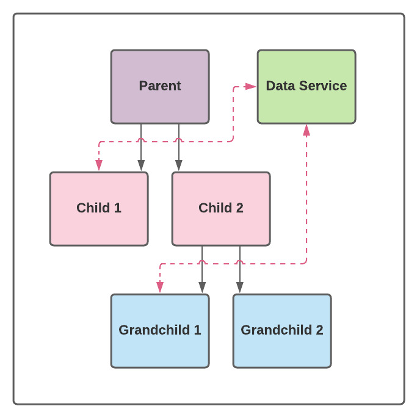

# Angular Component Communication Demo

This project demonstrates the use of a cache in an Angular service. For more info see the article on the DTA website

This branch represents the end state where we have a data service that components can tap into where needed.

## Development server

Run `ng serve` for a dev server. Navigate to `http://localhost:4200/`. The app will automatically reload if you change any of the source files.

## Running unit tests

Run `ng test` to execute the unit tests via [Karma](https://karma-runner.github.io).
